# STRIDE Threat Model

> **Generated by:** STRIDER (STRIDE Threat Modeling for CALM Architectures)  
> **Architecture:** Paul's MCP Architecture  
> **Version:** 1.0  
> **Date:** 4 December 2025  
> **Status:** Draft - For Discussion

---

## Executive Summary

This architecture implements an MCP (Model Context Protocol) system with **comprehensive security controls** already in place. Claude (MCP client) connects to an MCP Server to query operational reports via a Reports API, all deployed on Kubernetes. The architecture demonstrates mature security posture with FINOS AI Governance Framework mitigations applied at node, relationship, and flow levels.

**Key Findings:**
- 🔴 **Critical:** 2 unmitigated threats remaining
- 🟠 **High:** 4 threats with partial mitigations
- 🟡 **Medium:** 6 threats with adequate controls
- 🟢 **Low:** 8 threats fully mitigated

**Notable:** This architecture has significantly better security posture than typical MCP deployments due to pre-applied FINOS AI Governance Framework controls.

---

## Table of Contents

1. [System Overview](#system-overview)
2. [Data Flow Diagram](#data-flow-diagram)
3. [Trust Boundary Inventory](#trust-boundary-inventory)
4. [STRIDE Threat Analysis](#stride-threat-analysis)
5. [AI Governance Analysis](#ai-governance-analysis)
6. [Recommendations](#recommendations)
7. [Appendix: CALM Controls](#appendix-calm-controls)

---

## System Overview

### Architecture Description

This MCP-based architecture provides secure access to operational reports. An AI client (Claude) connects to an MCP Server with tool chain validation and credential protection. The MCP Server communicates with a Reports API using mTLS with certificate rotation. A Secret API is network-isolated using micro-segmentation. The architecture includes a documented flow for report queries with end-to-end security controls.

### Components

| Component | Type | Description | Controls Applied |
|-----------|------|-------------|------------------|
| Claude | mcp-client | MCP Client for querying reports | N/A (external) |
| Reports MCP Server | service | MCP Server with tools for operational reports | ✅ MCP Security Governance, Tool Chain Validation, Credential Protection |
| Reports API | service | API for accessing operational reports | N/A |
| Secret API | service | API isolated from MCP Server | ✅ Micro-segmentation |
| Kubernetes Cluster | system | K8s with network policy rules | N/A |

### Technology Stack

| Layer | Technology | Security Controls |
|-------|------------|-------------------|
| AI/ML | Claude (MCP Client) | TLS 1.3+ communication |
| MCP Server | Quarkus/JVM | Tool chain validation, credential protection |
| Backend | Reports API | mTLS with 30-day cert rotation |
| Infrastructure | Kubernetes | Network policies, micro-segmentation |

### Defined Flows

| Flow | Description | Controls |
|------|-------------|----------|
| Report Query Flow | End-to-end query from Claude → MCP Server → Reports API | End-to-end encryption, authentication, audit logging |

---

## Data Flow Diagram

```mermaid
flowchart TB
    subgraph External["🔴 Trust Boundary: External AI Client"]
        style External fill:#ffeeee,stroke:#cc0000,stroke-width:2px
        Claude{{"🤖 Claude<br/>MCP Client"}}
    end
    
    subgraph K8s["🟠 Trust Boundary: Kubernetes Cluster (conference namespace)"]
        style K8s fill:#fff5ee,stroke:#cc6600,stroke-width:2px
        
        subgraph Secured["🟢 Secured MCP Components"]
            style Secured fill:#eeffee,stroke:#00cc00,stroke-width:2px
            MCP["🔧 Reports MCP Server<br/>Port: 8080<br/>━━━━━━━━━━━━━<br/>✅ MCP Security Governance<br/>✅ Tool Chain Validation<br/>✅ Credential Protection"]
            Reports["⚙️ Reports API<br/>Port: 8080"]
        end
        
        subgraph Isolated["🔒 Network Isolated"]
            style Isolated fill:#ffe6e6,stroke:#990000,stroke-dasharray: 5 5
            Secret["🚫 Secret API<br/>✅ Micro-segmentation"]
        end
    end
    
    Claude -->|"HTTPS/TLS 1.3+ 🔒<br/>✅ Secure MCP Communication"| MCP
    MCP -->|"mTLS 🔐<br/>✅ API Auth + Audit"| Reports
    MCP -.-x|"❌ Blocked"| Secret
    
    linkStyle 0 stroke:#00cc00,stroke-width:3px
    linkStyle 1 stroke:#0066cc,stroke-width:3px
    linkStyle 2 stroke:#cc0000,stroke-width:2px,stroke-dasharray: 5 5
```



**Legend:**
- 🔴 Critical trust boundary (external AI client)
- 🟠 High trust boundary (Kubernetes cluster)
- 🟢 Secured components with FINOS controls
- 🔒 TLS 1.3+ encrypted
- 🔐 mTLS mutual authentication
- ❌ Blocked by network policy
- ✅ Control applied

---

## Trust Boundary Inventory

| ID | Boundary Name | From | To | Protocol | Controls | Criticality |
|----|---------------|------|-----|----------|----------|-------------|
| TB-1 | AI Tool Invocation | Claude | MCP Server | HTTPS/TLS 1.3+ | Secure MCP Communication | 🟠 High |
| TB-2 | Internal Service Mesh | MCP Server | Reports API | mTLS | API Authentication + Audit | 🟡 Medium |
| TB-3 | Network Isolation | Any | Secret API | Blocked | Micro-segmentation | 🟢 Low |

---

## STRIDE Threat Analysis

### TB-1: AI Tool Invocation Boundary (MCP Client → MCP Server)

**Boundary Details:**
- **From:** Claude (MCP Client)
- **To:** Reports MCP Server
- **Protocol:** HTTPS with TLS 1.3+
- **Criticality:** 🟠 High (reduced from Critical due to controls)

**Controls Applied:**
- ✅ `secure-mcp-communication` - TLS 1.3+, certificate validation, protocol monitoring
- ✅ `mcp-security-governance` - Tier-1 centralized proxy, pre-approved servers
- ✅ `tool-chain-validation` - Strict input validation, tool allowlist, injection prevention
- ✅ `credential-protection` - Vault-backed storage, least privilege

| STRIDE | Threat | Risk | Existing Control | Mitigation Status |
|--------|--------|------|------------------|-------------------|
| 🎭 Spoofing | Malicious client impersonates Claude | M | TLS 1.3+ with cert validation | ⚠️ |
| 🎭 Spoofing | Rogue MCP Server presents malicious tools | L | Pre-approved servers, centralized proxy | ✅ |
| 🔧 Tampering | Prompt injection causes unintended actions | M | Tool chain validation, injection prevention (sql, command, prompt) | ✅ |
| 🔧 Tampering | Man-in-the-middle modifies requests | L | TLS 1.3+ encryption | ✅ |
| 🙈 Repudiation | Tool invocations cannot be audited | M | Protocol monitoring, basic logging | ⚠️ |
| 📤 Info Disclosure | Sensitive data leaked to AI model | M | None identified | ❌ |
| 📤 Info Disclosure | Logs expose operational data | L | Basic connection logging | ⚠️ |
| 🚫 DoS | Excessive tool calls exhaust resources | M | None identified | ❌ |
| 🚫 DoS | Denial of Wallet - token exhaustion | M | None identified | ❌ |
| ⬆️ Elevation | Claude gains unauthorized tool access | L | Tool allowlist (get-reports, get-report-details) | ✅ |
| ⬆️ Elevation | Tool chain manipulation | L | Tool chain validation, parameter sanitization | ✅ |

**Discussion Points:**
- Is TLS client certificate authentication needed for Claude?
- Should comprehensive audit logging replace basic connection logging?
- What data filtering should be applied before returning data to Claude?
- Are rate limits needed on tool invocations?

---

### TB-2: Internal Service Mesh Boundary (MCP Server → Reports API)

**Boundary Details:**
- **From:** Reports MCP Server
- **To:** Reports API
- **Protocol:** mTLS
- **Criticality:** 🟡 Medium (well-controlled)

**Controls Applied:**
- ✅ `api-authentication` - mTLS, 30-day cert rotation, least privilege, audit all requests
- ✅ `credential-protection` - Vault-backed, no hardcoded secrets

| STRIDE | Threat | Risk | Existing Control | Mitigation Status |
|--------|--------|------|------------------|-------------------|
| 🎭 Spoofing | Attacker impersonates MCP Server | L | mTLS mutual authentication | ✅ |
| 🎭 Spoofing | Rogue service pretends to be Reports API | L | mTLS certificate validation | ✅ |
| 🔧 Tampering | Payloads modified in transit | L | mTLS encryption | ✅ |
| 🔧 Tampering | Malicious input exploits Reports API | M | Tool chain validation (upstream) | ⚠️ |
| 🙈 Repudiation | API calls not logged | L | Audit all requests enabled | ✅ |
| 📤 Info Disclosure | API returns excessive data | M | None identified | ❌ |
| 📤 Info Disclosure | Error messages reveal internals | L | None identified | ⚠️ |
| 🚫 DoS | MCP Server overwhelms Reports API | M | None identified | ❌ |
| ⬆️ Elevation | MCP Server exceeds API permissions | L | Least privilege access | ✅ |

**Discussion Points:**
- Should response filtering be added to the Reports API?
- Are rate limits needed between MCP Server and API?
- Is 30-day certificate rotation frequent enough?

---

### TB-3: Network Isolation Boundary (Cluster → Secret API)

**Boundary Details:**
- **From:** Any cluster component (especially MCP Server)
- **To:** Secret API
- **Protocol:** N/A (blocked)
- **Criticality:** 🟢 Low (fully mitigated)

**Controls Applied:**
- ✅ `security` (micro-segmentation) - Network policy blocks all access

| STRIDE | Threat | Risk | Existing Control | Mitigation Status |
|--------|--------|------|------------------|-------------------|
| 🎭 Spoofing | Network access to Secret API | L | Micro-segmentation | ✅ |
| 🔧 Tampering | Container escape to reach API | L | Network policy + pod isolation | ✅ |
| 🙈 Repudiation | Access attempts not logged | L | K8s audit logs (assumed) | ⚠️ |
| 📤 Info Disclosure | Policy misconfiguration | L | Explicit deny policy | ✅ |
| 🚫 DoS | Resource starvation | L | K8s resource limits (assumed) | ⚠️ |
| ⬆️ Elevation | Privilege escalation bypasses policy | L | Network policy + RBAC | ✅ |

---

## Threat Summary

| Trust Boundary | 🎭 | 🔧 | 🙈 | 📤 | 🚫 | ⬆️ | Overall |
|----------------|----|----|----|----|----|----|---------|
| TB-1: AI Tool Invocation | ⚠️ | ✅ | ⚠️ | ❌ | ❌ | ✅ | 🟠 High |
| TB-2: Internal Service Mesh | ✅ | ⚠️ | ✅ | ⚠️ | ❌ | ✅ | 🟡 Medium |
| TB-3: Network Isolation | ✅ | ✅ | ⚠️ | ✅ | ⚠️ | ✅ | 🟢 Low |

**Legend:** ✅ Mitigated | ⚠️ Partial | ❌ Unmitigated | ➖ N/A

---

## AI Governance Analysis

> ✅ **This architecture demonstrates mature AI governance with FINOS AI Governance Framework mitigations pre-applied.**

Refer to the [FINOS AI Governance Framework](https://air-governance-framework.finos.org) for detailed guidance.

### AI Components Identified

| Component | Type | Description | AIGF Mitigations |
|-----------|------|-------------|------------------|
| Claude | MCP Client | External AI querying reports | Secure communication |
| Reports MCP Server | MCP Server | Exposes tools with security controls | MI-19, MI-20, MI-23 |

### FINOS Mitigations Already Applied

| Mitigation ID | Mitigation Name | Applied To | Configuration |
|---------------|-----------------|------------|---------------|
| MI-20 | MCP Server Security Governance | MCP Server | Tier-1, centralized proxy, pre-approved servers |
| MI-19 | Tool Chain Validation | MCP Server | Strict input validation, tool allowlist, prompt injection prevention |
| MI-23 | Credential Protection | MCP Server, API relationship | Vault-backed, 30-day rotation, least privilege |

### Risks Addressed by Architecture

| Risk ID | Risk Name | Status | Control |
|---------|-----------|--------|---------|
| RI-26 | MCP Server Supply Chain Compromise | ✅ Mitigated | MI-20: Pre-approved servers |
| RI-25 | Tool Chain Manipulation | ✅ Mitigated | MI-19: Tool allowlist, validation |
| RI-29 | Agent Credential Harvesting | ✅ Mitigated | MI-23: Vault-backed credentials |
| AIR-SEC-024 | Prompt Injection | ✅ Mitigated | MI-19: Prompt injection prevention |
| AIR-SEC-025 | Agent Authorization Bypass | ✅ Mitigated | Tool allowlist + least privilege |

### Remaining AI Risks

| Risk ID | Risk Name | Impact | Gap |
|---------|-----------|--------|-----|
| AIR-RC-001 | Information Leaked to Hosted Model | 🟠 Medium | No data filtering before AI response |
| AIR-OP-014 | Availability / Denial of Wallet | 🟠 Medium | No rate limiting |
| AIR-OP-005 | Hallucination | 🟡 Low | Human review recommended |

### AI Trust Boundaries (from flow metadata)

| Boundary | Mitigations Applied | Status |
|----------|---------------------|--------|
| MCP Client-Server Boundary | MI-20, TLS 1.3+ | ✅ Secured |
| MCP Server-API Boundary | MI-23, mTLS | ✅ Secured |

---

## Recommendations

### Immediate Actions (🔴 Critical)

| # | Recommendation | Trust Boundary | Threat Addressed | Gap |
|---|----------------|----------------|------------------|-----|
| 1 | Add data filtering before returning reports to AI | TB-1 | 📤 Info Disclosure | AIR-RC-001 |
| 2 | Implement rate limiting on MCP Server endpoints | TB-1, TB-2 | 🚫 DoS | AIR-OP-014 |

### Short-Term Actions (🟠 High)

| # | Recommendation | Trust Boundary | Threat Addressed |
|---|----------------|----------------|------------------|
| 1 | Upgrade from basic logging to comprehensive audit logging | TB-1 | 🙈 Repudiation |
| 2 | Add response filtering on Reports API | TB-2 | 📤 Info Disclosure |
| 3 | Consider mTLS for Claude → MCP Server connection | TB-1 | 🎭 Spoofing |
| 4 | Add spend/usage monitoring and alerts | TB-1 | 🚫 DoS (Denial of Wallet) |

### Long-Term Actions (🟡 Medium)

| # | Recommendation | Trust Boundary | Threat Addressed |
|---|----------------|----------------|------------------|
| 1 | Implement human-in-the-loop for sensitive operations | TB-1 | AI governance |
| 2 | Add network policy change alerting | TB-3 | 🔧 Tampering |
| 3 | Consider AI output validation/review process | TB-1 | AIR-OP-005 |

---

## Appendix: CALM Controls

The following controls are defined in the CALM architecture:

### MCP Server Controls

#### 1. MCP Security Governance (MI-20)

```json
{
  "mcp-security-governance": {
    "description": "MCP Server Security Governance - Establishes comprehensive security controls...",
    "requirements": [{
      "requirement-url": "https://air-governance-framework.finos.org/mitigations/mi-20",
      "config": {
        "tier": "tier-1",
        "architecture": "centralized-proxy",
        "pre-approved-servers": true,
        "tls-encryption": "required",
        "logging": "basic-connection-logging",
        "mitigates-risks": ["RI-26"]
      }
    }]
  }
}
```
**Mitigates:** 🎭 Spoofing (rogue servers), RI-26 MCP Server Supply Chain

#### 2. Tool Chain Validation (MI-19)

```json
{
  "tool-chain-validation": {
    "description": "Tool Chain Validation and Sanitization...",
    "requirements": [{
      "requirement-url": "https://air-governance-framework.finos.org/mitigations/mi-19",
      "config": {
        "input-validation": "strict",
        "parameter-sanitization": true,
        "tool-allowlist": ["get-reports", "get-report-details"],
        "injection-prevention": ["sql", "command", "prompt"],
        "mitigates-risks": ["RI-25"]
      }
    }]
  }
}
```
**Mitigates:** 🔧 Tampering (prompt injection), ⬆️ Elevation (unauthorized tools), RI-25 Tool Chain Manipulation

#### 3. Credential Protection (MI-23)

```json
{
  "credential-protection": {
    "description": "Agentic System Credential Protection...",
    "requirements": [{
      "requirement-url": "https://air-governance-framework.finos.org/mitigations/mi-23",
      "config": {
        "credential-storage": "vault-backed",
        "credential-scoping": "least-privilege",
        "rotation-frequency": "30-days",
        "no-hardcoded-secrets": true,
        "mitigates-risks": ["RI-29"]
      }
    }]
  }
}
```
**Mitigates:** 🎭 Spoofing (credential theft), RI-29 Agent Credential Harvesting

### Relationship Controls

#### 4. Secure MCP Communication

```json
{
  "secure-mcp-communication": {
    "config": {
      "tls-version": "1.3+",
      "certificate-validation": "required",
      "mutual-authentication": false,
      "protocol-monitoring": true
    }
  }
}
```
**Mitigates:** 🔧 Tampering (MITM), 📤 Info Disclosure (eavesdropping)

#### 5. API Authentication

```json
{
  "api-authentication": {
    "config": {
      "authentication-method": "mtls",
      "certificate-rotation": "30-days",
      "least-privilege": true,
      "audit-all-requests": true
    }
  }
}
```
**Mitigates:** 🎭 Spoofing, 🙈 Repudiation, ⬆️ Elevation

### Node Controls

#### 6. Micro-segmentation (Secret API)

```json
{
  "security": {
    "description": "Lock down an individual POD workload",
    "requirements": [{
      "requirement-url": "https://calm.finos.org/workshop/controls/micro-segmentation.requirement.json",
      "config-url": "https://calm.finos.org/workshop/controls/micro-segmentation.config.json"
    }]
  }
}
```
**Mitigates:** 🎭 Spoofing, 📤 Info Disclosure, ⬆️ Elevation

---

## Security Posture Comparison

| Aspect | Segmented MCP Architecture | Paul's MCP Architecture |
|--------|---------------------------|-------------------------|
| MCP Server Controls | ❌ None | ✅ MI-19, MI-20, MI-23 |
| Tool Allowlist | ❌ None | ✅ get-reports, get-report-details |
| Prompt Injection Prevention | ❌ None | ✅ Configured |
| Credential Management | ❌ Unknown | ✅ Vault-backed |
| Relationship Controls | ❌ None | ✅ TLS 1.3+, mTLS, audit |
| Documented Flows | ❌ None | ✅ Report Query Flow |
| Overall Posture | 🔴 Critical gaps | 🟡 Mostly secured |

---

## Document History

| Version | Date | Author | Changes |
|---------|------|--------|---------|
| 1.0 | 4 December 2025 | STRIDER | Initial threat model |

---

## References

- [OWASP Threat Modeling Cheat Sheet](https://cheatsheetseries.owasp.org/cheatsheets/Threat_Modeling_Cheat_Sheet.html)
- [FINOS AI Governance Framework](https://air-governance-framework.finos.org)
- [FINOS CALM Specification](https://calm.finos.org)
- [Microsoft STRIDE](https://learn.microsoft.com/en-us/previous-versions/commerce-server/ee823878(v=cs.20))
