# STRIDE Threat Model

> **Generated by:** STRIDER (STRIDE Threat Modeling for CALM Architectures)  
> **Architecture:** Segmented MCP Architecture  
> **Version:** 1.0  
> **Date:** 4 December 2025  
> **Status:** Draft - For Discussion

---

## Executive Summary

This architecture implements an MCP (Model Context Protocol) system where Claude (an AI client) connects to an MCP Server to access operational reports via a Reports API, all deployed on a Kubernetes cluster. A Secret API is intentionally isolated using micro-segmentation controls to prevent unauthorized access from the MCP Server.

**Key Findings:**
- 🔴 **Critical:** 8 unmitigated threats requiring immediate attention (AI/MCP specific)
- 🟠 **High:** 3 threats with partial mitigations
- 🟡 **Medium:** 2 threats with adequate controls
- 🟢 **Low:** 1 threat fully mitigated (Secret API isolation)

---

## Table of Contents

1. [System Overview](#system-overview)
2. [Data Flow Diagram](#data-flow-diagram)
3. [Trust Boundary Inventory](#trust-boundary-inventory)
4. [STRIDE Threat Analysis](#stride-threat-analysis)
5. [AI Governance Analysis](#ai-governance-analysis)
6. [Recommendations](#recommendations)
7. [Appendix: CALM Controls](#appendix-calm-controls)

---

## System Overview

### Architecture Description

This is an MCP-based architecture for accessing operational reports. An AI client (Claude) connects to an MCP Server that exposes tools for reviewing weekly operational reports. The MCP Server retrieves data from a Reports API. A Secret API is deployed in the same cluster but is network-isolated to prevent the MCP Server from accessing it.

### Components

| Component | Type | Description | Interfaces |
|-----------|------|-------------|------------|
| Claude | mcp-client | MCP Client for querying for reports | N/A (external) |
| Reports MCP Server | service | MCP Server presenting tools for reviewing operational reports | Port 8080, Image: jpgough/mcp-server |
| Reports API | service | API for accessing operational reports raised by the team | Port 8080, Image: jpgough/details-jvm |
| Secret API | service | Deployed API that should not be available to the MCP Server | Port 8080, Image: jpgough/internal-api |
| Kubernetes Cluster | system | Kubernetes Cluster with network policy rules enabled | N/A |

### Technology Stack

| Layer | Technology | Notes |
|-------|------------|-------|
| AI/ML | Claude (MCP Client) | External AI model acting as MCP client |
| Backend | Quarkus/JVM Services | MCP Server and APIs |
| Infrastructure | Kubernetes | Network policies enabled, namespace: conference |
| Security | mTLS, Network Policies | Micro-segmentation for Secret API |

---

## Data Flow Diagram

```mermaid
flowchart TB
    subgraph External["🔴 Trust Boundary: External AI Client"]
        style External fill:#ffeeee,stroke:#cc0000,stroke-width:2px
        Claude{{"🤖 Claude<br/>MCP Client"}}
    end
    
    subgraph K8s["🟠 Trust Boundary: Kubernetes Cluster (conference namespace)"]
        style K8s fill:#fff5ee,stroke:#cc6600,stroke-width:2px
        
        subgraph Allowed["🟢 Allowed Communication Path"]
            style Allowed fill:#eeffee,stroke:#00cc00
            MCP["🔧 Reports MCP Server<br/>Port: 8080"]
            Reports["⚙️ Reports API<br/>Port: 8080"]
        end
        
        subgraph Isolated["🔒 Network Isolated (Micro-segmented)"]
            style Isolated fill:#ffe6e6,stroke:#990000,stroke-dasharray: 5 5
            Secret["🚫 Secret API<br/>Port: 8080"]
        end
    end
    
    Claude -->|"HTTPS 🔒"| MCP
    MCP -->|"mTLS 🔐"| Reports
    MCP -.-x|"❌ Blocked by Network Policy"| Secret
    
    linkStyle 0 stroke:#00cc00,stroke-width:2px
    linkStyle 1 stroke:#0066cc,stroke-width:2px
    linkStyle 2 stroke:#cc0000,stroke-width:2px,stroke-dasharray: 5 5
```



**Legend:**
- 🔴 Critical trust boundary (external AI client)
- 🟠 High trust boundary (Kubernetes cluster)
- 🟢 Allowed communication path
- 🔒 HTTPS encrypted
- 🔐 mTLS mutual authentication
- ❌ Blocked/denied connection (micro-segmentation)

---

## Trust Boundary Inventory

| ID | Boundary Name | From | To | Protocol | Criticality |
|----|---------------|------|-----|----------|-------------|
| TB-1 | AI Tool Invocation | Claude (MCP Client) | Reports MCP Server | HTTPS | 🔴 Critical |
| TB-2 | Internal Service Mesh | Reports MCP Server | Reports API | mTLS | 🟠 High |
| TB-3 | Network Isolation | Any Cluster Component | Secret API | Blocked | 🟢 Low (Mitigated) |

---

## STRIDE Threat Analysis

### TB-1: AI Tool Invocation Boundary (MCP Client → MCP Server)

**Boundary Details:**
- **From:** Claude (MCP Client)
- **To:** Reports MCP Server
- **Protocol:** HTTPS
- **Criticality:** 🔴 Critical - External AI agent invoking internal tools

| STRIDE | Threat | Risk | Existing Control | Mitigation Status |
|--------|--------|------|------------------|-------------------|
| 🎭 Spoofing | Malicious client impersonates Claude to access MCP Server tools | H | HTTPS (transport only) | ❌ |
| 🎭 Spoofing | Rogue MCP Server presents malicious tools to Claude | H | None identified | ❌ |
| 🔧 Tampering | Prompt injection causes MCP Server to perform unintended actions | H | None identified | ❌ |
| 🔧 Tampering | Man-in-the-middle modifies tool requests/responses | M | HTTPS encryption | ⚠️ |
| 🙈 Repudiation | AI tool invocations cannot be traced or audited | M | None identified | ❌ |
| 📤 Info Disclosure | Sensitive report data leaked to AI model's training | H | None identified | ❌ |
| 📤 Info Disclosure | Prompt/response logs expose operational data | M | None identified | ❌ |
| 🚫 DoS | Excessive tool calls exhaust MCP Server resources | M | None identified | ❌ |
| 🚫 DoS | Denial of Wallet - excessive API/token consumption | H | None identified | ❌ |
| ⬆️ Elevation | Claude gains access to tools beyond intended scope | H | None identified | ❌ |
| ⬆️ Elevation | Tool chain manipulation allows access to Secret API | H | Network Policy (indirect) | ⚠️ |

**Discussion Points:**
- How is the MCP Client (Claude) authenticated to the MCP Server?
- What audit logging exists for tool invocations?
- Are there rate limits on tool calls?
- What data classification applies to the operational reports?
- Is there human-in-the-loop for sensitive operations?

---

### TB-2: Internal Service Mesh Boundary (MCP Server → Reports API)

**Boundary Details:**
- **From:** Reports MCP Server
- **To:** Reports API
- **Protocol:** mTLS
- **Criticality:** 🟠 High - Internal service-to-service communication

| STRIDE | Threat | Risk | Existing Control | Mitigation Status |
|--------|--------|------|------------------|-------------------|
| 🎭 Spoofing | Attacker impersonates MCP Server to access Reports API | M | mTLS mutual authentication | ✅ |
| 🎭 Spoofing | Rogue service pretends to be Reports API | M | mTLS certificate validation | ✅ |
| 🔧 Tampering | Request/response payloads modified in transit | L | mTLS encryption | ✅ |
| 🔧 Tampering | Malicious input from MCP Server exploits Reports API | M | None identified | ❌ |
| 🙈 Repudiation | API calls not logged with caller identity | M | None identified | ❌ |
| 📤 Info Disclosure | API returns excessive data not needed by MCP Server | M | None identified | ❌ |
| 📤 Info Disclosure | Error messages reveal internal implementation details | L | None identified | ⚠️ |
| 🚫 DoS | MCP Server overwhelms Reports API with requests | M | None identified | ❌ |
| ⬆️ Elevation | MCP Server accesses API endpoints beyond its role | M | None identified | ❌ |

**Discussion Points:**
- What input validation exists on the Reports API?
- Are API responses filtered to return only necessary data?
- How is certificate rotation handled for mTLS?
- What monitoring exists for unusual access patterns?

---

### TB-3: Network Isolation Boundary (Cluster → Secret API)

**Boundary Details:**
- **From:** Any cluster component (especially MCP Server)
- **To:** Secret API
- **Protocol:** N/A (blocked by network policy)
- **Criticality:** 🟢 Low - Actively mitigated by micro-segmentation control

| STRIDE | Threat | Risk | Existing Control | Mitigation Status |
|--------|--------|------|------------------|-------------------|
| 🎭 Spoofing | Attacker gains network access to reach Secret API | L | Micro-segmentation network policy | ✅ |
| 🔧 Tampering | Container escape allows access to Secret API | M | Network policy + pod isolation | ⚠️ |
| 🙈 Repudiation | Access attempts to Secret API not logged | L | Kubernetes audit logs (assumed) | ⚠️ |
| 📤 Info Disclosure | Secret API data exposed via misconfigured policy | L | Explicit deny policy | ✅ |
| 🚫 DoS | Resource starvation affects Secret API | L | Kubernetes resource limits (assumed) | ⚠️ |
| ⬆️ Elevation | Privilege escalation bypasses network policy | L | Network policy + RBAC | ⚠️ |

**Discussion Points:**
- Is the network policy tested regularly for effectiveness?
- What alerting exists if the network policy is modified or deleted?
- Are there additional controls (RBAC, PodSecurityPolicy) in place?
- Is the Secret API's access pattern monitored?

---

## Threat Summary

| Trust Boundary | 🎭 | 🔧 | 🙈 | 📤 | 🚫 | ⬆️ | Overall |
|----------------|----|----|----|----|----|----|---------|
| TB-1: AI Tool Invocation | ❌ | ❌ | ❌ | ❌ | ❌ | ❌ | 🔴 Critical |
| TB-2: Internal Service Mesh | ✅ | ⚠️ | ❌ | ⚠️ | ❌ | ❌ | 🟠 High |
| TB-3: Network Isolation | ✅ | ⚠️ | ⚠️ | ✅ | ⚠️ | ⚠️ | 🟢 Low |

**Legend:** ✅ Mitigated | ⚠️ Partial | ❌ Unmitigated | ➖ N/A

---

## AI Governance Analysis

> ⚠️ **This section is included because AI/MCP components were detected in the architecture.**

Refer to the [FINOS AI Governance Framework](https://air-governance-framework.finos.org) for detailed guidance.

### AI Components Identified

| Component | Type | Description |
|-----------|------|-------------|
| Claude | MCP Client | External AI model querying for operational reports |
| Reports MCP Server | MCP Server | Exposes tools for reviewing weekly operational reports |

### AI-Specific Risks (FINOS AI Risk Catalogue)

| Risk ID | Risk Name | Impact | Current Controls | Status |
|---------|-----------|--------|------------------|--------|
| AIR-SEC-024 | Prompt Injection | 🔴 High - Could manipulate tool behavior | None identified | ❌ |
| AIR-SEC-025 | Agent Action Authorization Bypass | 🔴 High - Claude exceeding intended scope | None identified | ❌ |
| AIR-SEC-026 | Tool Chain Manipulation | 🔴 High - Malicious tool selection | None identified | ❌ |
| AIR-SEC-027 | MCP Server Supply Chain Compromise | 🟠 Medium - Container from public registry | None identified | ❌ |
| AIR-OP-005 | Hallucination | 🟠 Medium - Incorrect report interpretation | None identified | ❌ |
| AIR-OP-014 | Availability of Foundational Model | 🟠 Medium - External dependency on Claude | None identified | ❌ |
| AIR-RC-001 | Information Leaked to Hosted Model | 🔴 High - Report data sent to external model | None identified | ❌ |

### AI Trust Boundaries

| Boundary | Description | Special Considerations |
|----------|-------------|----------------------|
| Human ↔ AI | User interacting with Claude | User may attempt prompt injection |
| AI ↔ Tools | Claude invoking MCP Server tools | Tool selection and parameter validation |
| AI ↔ Data | Access to operational reports | Data classification and filtering |

### Recommended AI Mitigations

Based on the [FINOS AI Governance Framework](https://air-governance-framework.finos.org):

1. **Input/Output Filtering (AIR-PREV-005)**
   - Implement prompt injection detection on MCP Server
   - Filter sensitive data before returning to AI model
   - Consider PII detection and redaction

2. **Agent Least Privilege (AIR-PREV-019)**
   - Define explicit tool permissions for Claude
   - Limit which reports/data the AI can access
   - Implement tool-level authorization

3. **MCP Server Security Governance (AIR-PREV-021)**
   - Verify MCP Server container image provenance
   - Implement image signing and scanning
   - Use private container registry

4. **Tool Chain Validation (AIR-PREV-020)**
   - Validate tool parameters before execution
   - Implement allow-list of permitted operations
   - Log all tool invocations for audit

5. **Spend Monitoring (AIR-DET-011)**
   - Set alerts for excessive API consumption
   - Implement rate limiting on tool calls
   - Monitor for unusual access patterns

6. **Human Feedback Loop (AIR-DET-013)**
   - Enable user reporting of incorrect AI responses
   - Review AI outputs for sensitive operations

---

## Recommendations

### Immediate Actions (🔴 Critical)

| # | Recommendation | Trust Boundary | Threat Addressed |
|---|----------------|----------------|------------------|
| 1 | Implement MCP Client authentication to MCP Server | TB-1 | 🎭 Spoofing |
| 2 | Add prompt injection detection/filtering | TB-1 | 🔧 Tampering |
| 3 | Implement comprehensive audit logging for tool invocations | TB-1 | 🙈 Repudiation |
| 4 | Add data filtering to prevent sensitive data leakage to AI | TB-1 | 📤 Info Disclosure |
| 5 | Define and enforce tool permission boundaries | TB-1 | ⬆️ Elevation |

### Short-Term Actions (🟠 High)

| # | Recommendation | Trust Boundary | Threat Addressed |
|---|----------------|----------------|------------------|
| 1 | Implement rate limiting on MCP Server endpoints | TB-1, TB-2 | 🚫 DoS |
| 2 | Add input validation on Reports API | TB-2 | 🔧 Tampering |
| 3 | Implement API response filtering (least data principle) | TB-2 | 📤 Info Disclosure |
| 4 | Set up container image scanning and signing | TB-1 | AIR-SEC-027 |
| 5 | Implement spend/usage monitoring and alerts | TB-1 | AIR-DET-011 |

### Long-Term Actions (🟡 Medium)

| # | Recommendation | Trust Boundary | Threat Addressed |
|---|----------------|----------------|------------------|
| 1 | Add automated testing for network policy effectiveness | TB-3 | 🔧 Tampering |
| 2 | Implement anomaly detection for unusual access patterns | TB-1, TB-2 | Multiple |
| 3 | Establish human-in-the-loop for sensitive operations | TB-1 | AIR-SEC-025 |
| 4 | Create incident response plan for AI security events | All | Multiple |

---

## Appendix: CALM Controls

The following controls are defined in the CALM architecture and were considered during this threat model:

### Micro-segmentation Control (Secret API)

```json
{
  "controls": {
    "security": {
      "description": "Lock down an individual POD workload",
      "requirements": [
        {
          "requirement-url": "https://calm.finos.org/workshop/controls/micro-segmentation.requirement.json",
          "config-url": "https://calm.finos.org/workshop/controls/micro-segmentation.config.json"
        }
      ]
    }
  }
}
```

**Applied to:** Secret API node  
**Mitigates:** 
- 🎭 Spoofing - Prevents unauthorized network access
- 📤 Info Disclosure - Blocks data exfiltration paths
- ⬆️ Elevation - Limits lateral movement from MCP Server

**Effectiveness:** This control effectively isolates the Secret API from the MCP Server, preventing the AI agent from accessing sensitive data even if tool chain manipulation were successful.

---

## Document History

| Version | Date | Author | Changes |
|---------|------|--------|---------|
| 1.0 | 4 December 2025 | STRIDER | Initial threat model |

---

## References

- [OWASP Threat Modeling Cheat Sheet](https://cheatsheetseries.owasp.org/cheatsheets/Threat_Modeling_Cheat_Sheet.html)
- [FINOS AI Governance Framework](https://air-governance-framework.finos.org)
- [FINOS CALM Specification](https://calm.finos.org)
- [Microsoft STRIDE](https://learn.microsoft.com/en-us/previous-versions/commerce-server/ee823878(v=cs.20))
